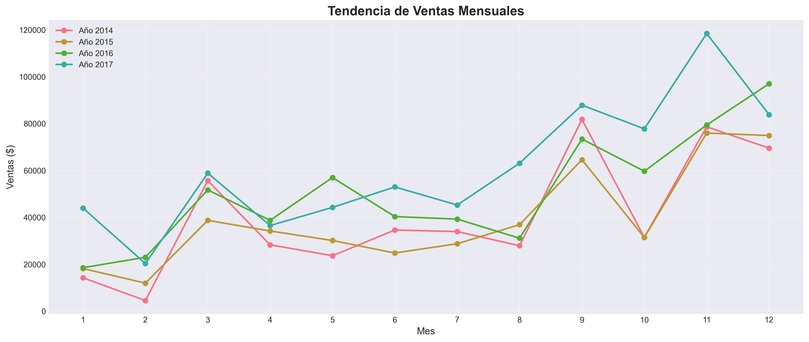
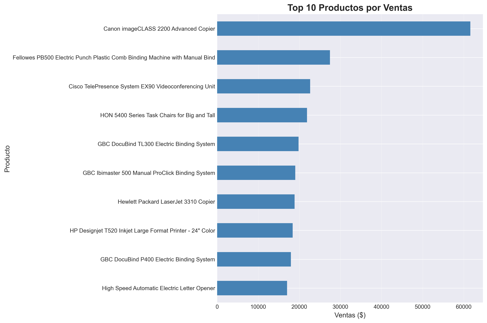

# 📊 Análisis de Ventas - Retail

Análisis exploratorio de datos de ventas de una tienda retail para identificar patrones, productos más rentables y oportunidades de optimización.


## 🎯 Objetivo del Proyecto

Analizar el comportamiento de ventas de una cadena retail para:
- Identificar productos y categorías más rentables
- Detectar tendencias estacionales
- Optimizar estrategia de inventario por región
- Proporcionar insights accionables para el negocio

## 🗂️ Dataset

- **Fuente:** Kaggle - Superstore Dataset
- **Tamaño:** 9,994 registros
- **Período:** 2014-2017
- **Variables:** 21 columnas (ventas, ganancias, categorías, regiones, etc.)

## 🛠️ Herramientas Utilizadas

- **Python 3.11**
  - Pandas - Manipulación de datos
  - NumPy - Operaciones numéricas
  - Matplotlib & Seaborn - Visualización
- **Jupyter Notebook** - Análisis exploratorio
- **Git/GitHub** - Control de versiones

## 🔍 Proceso de Análisis

### 1. Limpieza de Datos
- Verificación de valores nulos
- Eliminación de duplicados
- Conversión de tipos de datos
- Creación de variables temporales

### 2. Análisis Exploratorio
- Estadísticas descriptivas
- Análisis de distribuciones
- Identificación de outliers
- Segmentación por categorías y regiones

### 3. Visualización de Resultados
- Gráficos de ventas por categoría
- Tendencias temporales
- Rankings de productos
- Análisis geográfico

## 💡 Insights Principales

### 1. **Categoría Líder: Technology**
- Genera el mayor volumen de ventas
- Mayor margen de ganancia promedio
- Productos estrella: teléfonos y accesorios

### 2. **Estacionalidad Marcada**
- Pico de ventas en Q4 (Noviembre-Diciembre)
- Oportunidad de optimizar inventario pre-temporada alta
- Promociones estratégicas en Q1-Q2

### 3. **Concentración Geográfica**
- Región West lidera en ventas
- Oportunidad de expansión en regiones con menor penetración
- Diferencias en preferencias de productos por región

### 4. **Regla 80/20 Confirmada**
- 20% de productos generan 80% de las ganancias
- Enfoque recomendado en productos de alto margen

## 📊 Dashboard Interactivo


Dashboard interactivo en Power BI que incluye:
- KPIs principales (ventas, ganancia, margen)
- Filtros dinámicos por año, categoría y región
- Visualizaciones de tendencias y comparativas
- Top productos en tiempo real

📥 [Descargar dashboard (.pbix)](dashboards/dashboard_ventas.pbix)

## 📊 Visualizaciones






## 🚀 Cómo Ejecutar el Proyecto
```bash
# 1. Clonar el repositorio
git clone https://github.com/[tu-usuario]/analisis-ventas-retail.git

# 2. Navegar a la carpeta
cd analisis-ventas-retail

# 3. Instalar dependencias
pip install pandas numpy matplotlib seaborn jupyter

# 4. Abrir Jupyter Notebook
jupyter notebook notebooks/analisis_exploratorio.ipynb
```

## 📁 Estructura del Proyecto
```
analisis-ventas-retail/
├── data/                      
├── notebooks/                 
│   └── analisis_exploratorio.ipynb
├── resultados/                
│   ├── ventas_por_categoria.png
│   ├── tendencia_ventas.png
│   ├── top_productos.png
│   └── ventas_por_region.png
├── dashboards/                
└── README.md
```

## 🎓 Aprendizajes

- Limpieza y preparación de datos reales
- Análisis exploratorio completo con Pandas
- Visualización efectiva de insights de negocio
- Comunicación de resultados de forma clara

## 📧 Contacto

**[Valentin Avila]**
- 💼 LinkedIn: 
- 📧 Email: 
- 🌐 Workana: 

---

⭐ Si te gustó este proyecto, ¡dale una estrella!

💼 Disponible para proyectos freelance de análisis de datos.